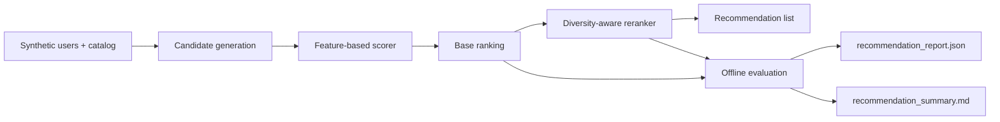

# recommendation-studio

A local-first recommendation workflow that generates user-item candidates, scores them for relevance, reranks for diversity, and reports the tradeoff between recommendation quality, novelty, and diversity.

## Problem

A recommender that only chases raw relevance often collapses into repetitive, popularity-heavy results. Real recommendation systems need to balance multiple objectives: likely engagement, novelty, and enough diversity that the list feels useful instead of redundant. This repo focuses on that explicit tradeoff.

## Architecture

The implementation keeps the system laptop-runnable while still reflecting a recommendation stack:

- deterministic user profiles and catalog metadata simulate a personalization workload
- a candidate generator produces user-item pairs with behavioral and content-style features
- a scoring model estimates base recommendation relevance
- a reranking layer applies a diversity penalty to reduce same-category saturation
- an evaluation layer reports precision, novelty, and intra-list diversity for both the base ranking and multiple reranking strategies

## Pipeline Walkthrough

The recommendation flow is intentionally explicit so each step is easy to inspect:

1. `app/dataset.py` creates synthetic users, catalog items, and candidate rows.
2. `app/training.py` trains the base scorer on those candidate features.
3. `app/reranking.py` runs multiple reranking strategies over the same candidate list.
4. `app/evaluation.py` measures precision, novelty, and diversity for the base ranking and each reranking strategy.
5. `app/reporting.py` writes the JSON and Markdown artifacts that summarize the run.
6. `app/main.py` exposes a FastAPI surface for interactive recommendation lookup.



## Tradeoffs

This implementation makes three deliberate tradeoffs:

1. The dataset is synthetic so recommendation behavior stays reproducible and easy to inspect locally.
2. The scorer is a simple feature-based model rather than collaborative filtering with embeddings so the ranking tradeoffs stay clear and reproducible.
3. Diversity is handled by a transparent reranker instead of a more complex constrained optimizer so the recommendation logic remains explainable.

## Repo Layout

```text
recommendation-studio/
├── app/
│   ├── cli.py
│   ├── dataset.py
│   ├── evaluation.py
│   ├── main.py
│   ├── reranking.py
│   └── training.py
├── generated/
└── tests/
```

## Run Steps

### Install Dependencies

```bash
git clone https://github.com/srn91/recommendation-studio.git
cd recommendation-studio
python3 -m pip install -r requirements.txt
```

### Generate the Recommendation Report

```bash
make report
```

That writes:

- `generated/recommendation_report.json`
- `generated/recommendation_summary.md`

### Start the API

```bash
make serve
```

Useful endpoints:

- `http://127.0.0.1:8004/health`
- `http://127.0.0.1:8004/users`
- `http://127.0.0.1:8004/recommend/user_0001?k=5`
- `http://127.0.0.1:8004/recommend/new_user_9000?k=5&preferred_category=wellness`

### Run the Full Quality Gate

```bash
make verify
```

## Hosted Deployment

- Live URL: [https://recommendation-studio.onrender.com](https://recommendation-studio.onrender.com)
- First path to click: `/health`, then `/recommend/user_0001?k=5`
- Browser smoke: passed on `/recommend/user_0001?k=5`; direct HTTP to `/health` and `/recommend/user_0001?k=5` returned `200`
- Render config: Git-backed Python web service on `main`, `buildCommand=python3 -m pip install -r requirements.txt`, `startCommand=uvicorn app.main:app --host 0.0.0.0 --port $PORT`, `healthCheckPath=/health`, `plan=free`, `region=oregon`, auto-deploy enabled

## Validation

The repo currently verifies:

- deterministic candidate generation and recommendation output
- base relevance ranking and diversity-aware reranking for the same user
- offline precision@5, novelty, and intra-list diversity metrics
- reranked lists improve diversity and novelty without collapsing precision
- the report compares multiple reranking strategies under the same evaluation set and selects a default one
- unknown users can still receive a category-aware cold-start list driven by catalog metadata

Measured local snapshot from the report:

- users evaluated: `18`
- base precision@5: `1.0`
- reranked precision@5: `0.8`
- base diversity@5: `0.4`
- reranked diversity@5: `0.6`
- base novelty@5: `0.19`
- reranked novelty@5: `0.5004`

Current expected evaluation snapshot:

- users evaluated: `18`
- base precision@5: at least `0.78`
- reranked precision@5: at least `0.72`
- reranked diversity score higher than base diversity score
- reranked novelty score stays competitive with base ranking

Local quality gates:

- `make lint`
- `make test`
- `make report`
- `make verify`

## Current Capabilities

The repo demonstrates:

- deterministic user-item recommendation candidates
- feature-based recommendation scoring
- diversity-aware reranking
- side-by-side comparison of multiple reranking strategies
- offline tradeoff metrics for relevance, novelty, and diversity
- FastAPI surface for recommendation retrieval
- content-metadata cold-start fallback for users with no behavioral history
